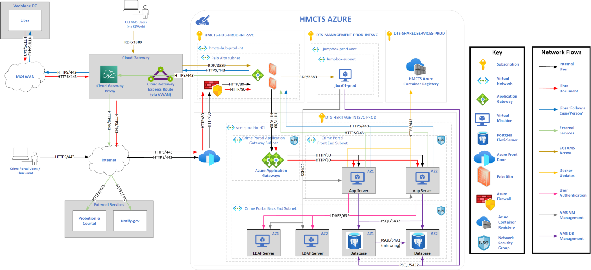

# crime-portal-infra

## Introduction

The Crime Portal service comprises of a thin client user interface, with the back-end application formed by a series of Service-oriented architecture (SOA) components, deployed as a Docker image to an Azure hosted environment. The Crime Portal storage is hosted in a Postgres database.

Communication between Libra and Crime Portal is maintained by additional Gateway and Data Access components. Libra sends content data, in the form of binary and XML, through these Gateway services to be consumed by external endpoints who have subscribed to this data. These communication services also allows the Crime Portal application to enquire on case and person information held within the Libra database. These Crime Portal services are referred to as ‘Follow a Case’ and ‘Follow a Person’ respectively. 

As well as external interfaces, there is an administration role performed by Crime IT staff. 

## Overview

This README file provides an overview of the project, including VM details, networking configurations, automation/installation of the operating system, relevant documentation links, diagrams and operational information.

## VM Details

Crime Portal is deployed to two environments, Staging (STG), and Production (Prod) as two sets of redundant virtual machines:

| VM Name                          | VM SKU           | Operating System |
|----------------------------------|------------------|------------------|
| crime-portal-frontend-vm01-{env} | Standard D4ds v5 | Ubuntu 22.04     |
| crime-portal-frontend-vm02-{env} | Standard D4ds v5 | Ubuntu 22.04     |
| crime-portal-ldap-vm01-{env}     | Standard D4ds v5 | Ubuntu 22.04     |
| crime-portal-ldap-vm02-{env}     | Standard D4ds v5 | Ubuntu 22.04     |

## Disk configurations

Each Crime Portal VM is configured with one OS Disk only. All disks are configured to use Server Side Encryption (SSE) utilizing a Platform Managed Key (PMK)

| Disk Name                                 | Disk Type | Disk SKU         | Disk Size (GB) | Encryption   |
|-------------------------------------------|-----------|------------------|----------------|--------------|
| crime-portal-frontend-vm01-{env}_OsDisk_1 | OS        | Standard SSD LRS | 128            | SSE with PMK |
| crime-portal-frontend-vm02-{env}_OsDisk_1 | OS        | Standard SSD LRS | 128            | SSE with PMK |
| crime-portal-ldap-vm01-{env}_OsDisk_1     | OS        | Standard SSD LRS | 128            | SSE with PMK |
| crime-portal-ldap-vm02-{env}_OsDisk_1     | OS        | Standard SSD LRS | 128            | SSE with PMK |

## Backup Policy

The Crime Portal VMs are Backed up daily. The backup process is managed by a Azure Recovery Services Vault in each environment.

| Environment | Backup Frequency      | Daily Backup Retention Period | Monthly Backup Retention Period | Yearly Backup Retention Period |
|-------------|-----------------------|-------------------------------|---------------------------------|--------------------------------|
| Production  | Daily at 01:00 AM UTC | 28 Days                       | 12 Months                       | 1 Year                         |
| Saging      | Daily at 01:00 AM UTC | 7 Days                        | 12 Months                       | 1 Year                         |

## Database

The Crime Portal Database is implemented using a PostgreSQL flexible server instance in each environment. The database is configured with an automatic daily backup and the backups are retained for 35 days.

## VM Access

The Crime Portal VMs can be accessed over the HMCTS Jumpboxes or bastions using the az CLI with the SSH extension. The Crime Portal VMs use Azure Entra ID to authenticate, so it is necessary to use `az ssh` as opposed to plain `ssh` when logging in.

## Networking Configs

Inbound/outbound traffic in Crime Portal is detailed in the below HLD diagram:

## Additional Software

The following software is installed on the VMs using virtual machine extensions:

- Docker
- AAD SSH Login for Linux
- Azure Monitor
- Dynatrace One Agent
- Splunk Universal Forwarder
- Tenable Nessus

## Change Process

Changes to Crime Portal must go through the [change management process](https://hmcts.github.io/ops-runbooks/Change-Requests/How-to-raise-a-Change-request.html#raise-a-change-request). Crime Portal falls under the 'Libra Crime Portal' service offering and changes require approval from the 'Libra Crime Portal Business Change Approvals' in addition to the normal change approvers. [CHG5000501](https://mojcppprod.service-now.com/nav_to.do?uri=change_request.do?sys_id=eb3e7d301bb2841cd9b81f4c2e4bcbed) may be used as a template change request from which to clone.

## Crime Portal HLD:

The High Level Design (HLD) for Crime Portal can be found on [sharepoint](https://justiceuk.sharepoint.com/:w:/r/sites/VDE-CRIMEPORTAL/_layouts/15/Doc.aspx?sourcedoc=%7B263F6000-3FA5-4026-96E5-A2E4E1469043%7D&file=DLRM%20Crime%20Portal%20HLD%20v0.15.docx&wdLOR=cA78BA6EF-4F38-2045-BAD8-1E03936E48B6&fromShare=true&action=default&mobileredirect=true).